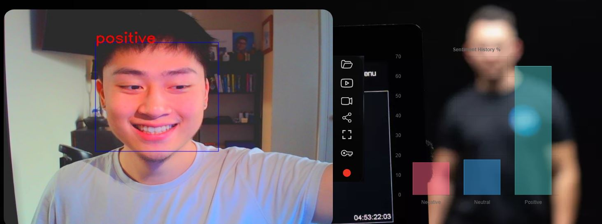

# Sentiment Detection in Real-Time
This app uses computer vision to detect the sentiment of users through their facial expressions. It captures video input through a webcam and detects the users sentiment in real-time. The model is a fine-tuned version of [VGG19](https://keras.io/api/applications/vgg/) on the [FER-2013](https://www.kaggle.com/datasets/msambare/fer2013) dataset that was relabelled into three categories:
- Positive
- Negative
- Neutral

### Project Directory
- [archive](archive): Folder containing previously tested models.
- [static](static): Folder containing assets used by templates (CSS, image files)
- [templates](templates): Folder containing html templates
- [camera.py](camera.py): Obtains video input from webcam, detects faces, and makes inferences
- [main.py](main.py): Deploys webapp with Flask API
- [model-training-VGG19.ipynb](model-training-VGG19.ipynb): Jupyter notebook to fine-tune the VGG-19 model with tensorflow
- [model.h5](model.h5): The trained model

### Installation
1. Clone this repository to your local machine:
   
```
git clone https://github.com/tl-lay/sentiment-detection-project.git
```

2. Install the required dependencies

```
pip install -r requirements.txt
```

### Usage
1. Run the main application file, `main.py`, using the following command:
```
python main.py
```
2. Open the following link in your web browser:
```
http://localhost:5000/
```
3. Follow the prompts to start making inferences

### Example


